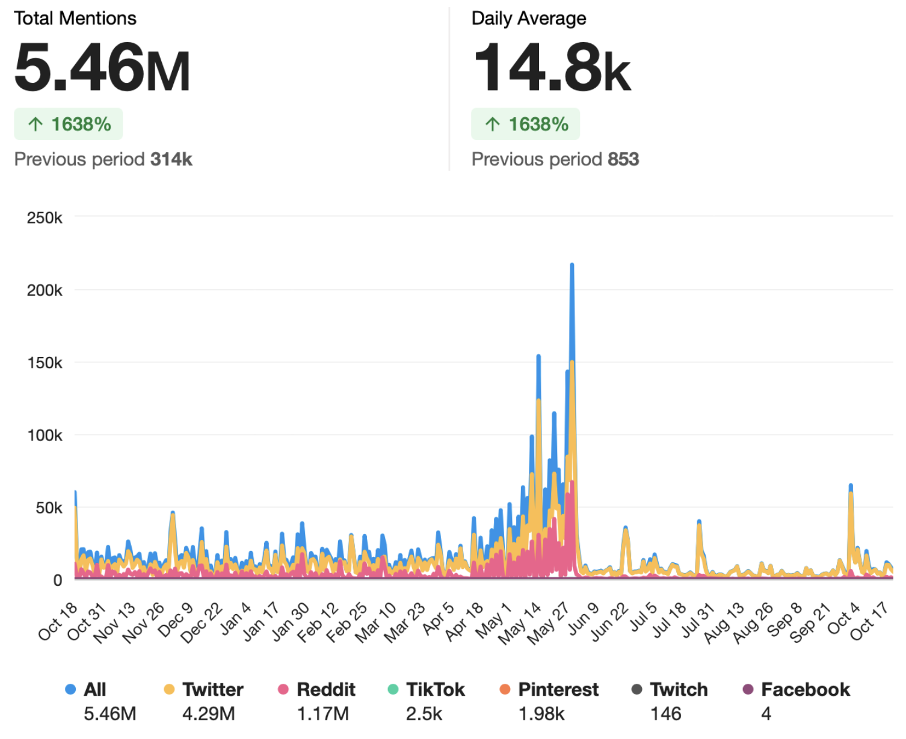
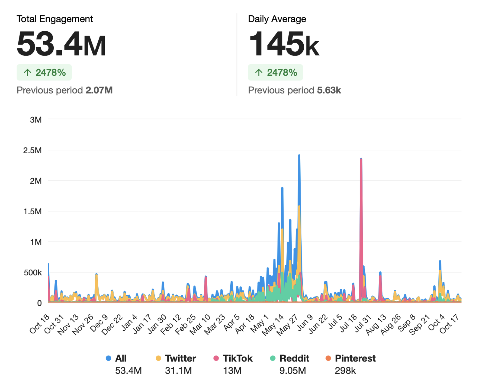
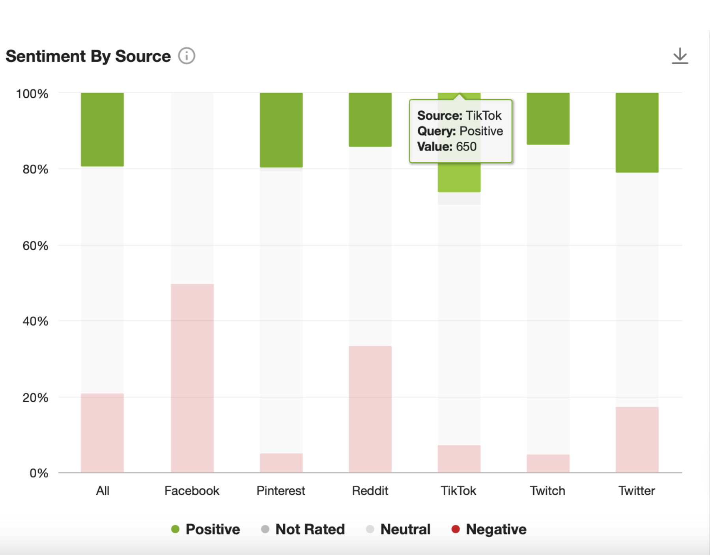

# Insights From Data Analytics

## Insights from Meltwater's User Engagement Data

### Mentions Distribution by Sources

From October 2022 to October 2023, Twitter/X and Reddit have been identified as the most popular channels for online discussions about the Celtics, with their conversation volumes reaching over millions (see figure 5.1). Additionally, throughout this time range, there were several noticeable peaks in the overall conversation volume. These peaks likely correspond to highlight events involving the franchise, such as the game against the Brooklyn Nets, led by Kevin Durant on December 4, and the Eastern Conference Finals against the Miami Heat starting in mid-May 2023. These key events seem to have significantly driven online posts among the fan base.



### Engagement Distribution by Sources

However, The total engagement metrics, which include likes, shares, and comments, reveal an interesting trend: although there are significantly fewer mentions of the Celtics on TikTok compared to Twitter/X and Reddit, the content related to the Celtics on TikTok is highly interactive and likely includes viral video content. Specifically, on TikTok, the ratio of engagement to mentions is a crazily staggering 5200 (i.e., 13 million engagements for 0.025 million mentions), indicating a very high level of user interaction per post. In contrast, on Twitter/X and Reddit, this metric is much lower, with ratios of 7.25 and 7.74 (see figure 5.1 and 5.2). This disparity suggests that while Twitter and Reddit have higher volumes of conversation, TikTok's content has a significantly greater capacity for engagement per mention.



### Sentiment by Sources

Additionally, compared to toher platforms, conversations about Celtics on TikTok is much more positive, which could indicate that the generated contents by fans there is both entertaining and favorable towards the Celtics （see figure 5.3).



### A Customized Campaign to Enahnce Engagement on TikTok

Given these insights, while Twitter/X is recognized as the central hub for Celtics-related conversations and interactions, TikTok emerges as a platform with high potential for building a favorable fan community. Its ability to enhance positive online discussions about the franchise and unite fans is particularly notable due to its high engagement ratio. The interactive and often viral nature of content on TikTok can be leveraged to foster a more engaged and enthusiastic fan community, contributing significantly to the overall positive sentiment and visibility of the Celtics brand in the digital space.

## Insights from Twitter/X Data

```{r, echo=FALSE, message=FALSE}
library(NLP)
library(stringr)
library(purrr)
library(igraph)
library(crayon)
library(gridExtra)
library(tidyr)
library(ggplot2)
library(gridExtra)
library(ggplot2)
library(reshape2)
library(tm)
library(base)
library(SparseM)
library(SnowballC)
library(tidytext)
library(rio)
library(syuzhet)
library(ggplot2)
library(stargazer)
library(car)
library(plotly)
library(dplyr)
library(sandwich)
library(lmtest)
library(lubridate)
library(topicmodels)
data<-import("Season_2023.xlsx")
data <- data %>% 
  mutate(Day = as.Date(Day, format="%Y-%m-%d")) %>%
  arrange(Day)
data$Likes[is.na(data$Likes)] <- 0
data$Replies[is.na(data$Replies)] <- 0
```

```{r, echo=FALSE, message=FALSE}
text<-data$`Hit Sentence`
text <- gsub("[^\x20-\x7e]"," ", text)
text <- gsub("(@|http)[^[:blank:]]*|[[:punct:]]|[[:digit:]]"," ", text)
text <- gsub("(?<=[\\s])\\s*|^\\s+|\\s+$", "", text, perl=TRUE)
sentiment_bing <- get_sentiment(text, method = "bing")
sentiment_new<-ifelse(sentiment_bing < 0, -1, sentiment_bing)
sentiment_new<-ifelse(sentiment_new > 0, 1, sentiment_new)
sentiment_new<-ifelse(sentiment_new == 0, 0, sentiment_new) 
data$sentiment<-sentiment_new

data<-data %>%
  group_by(Day) %>%
  mutate(Daily_Reach = mean(Reach, na.rm = TRUE))
```

### Reach Distribution by Topics

```{r, echo=FALSE, message=FALSE}
data$document <- 1: length(data$`Hit Sentence`) #assign an unique id each document

myCorpus<-VCorpus(VectorSource(text))

myCorpus<-tm_map(myCorpus, removePunctuation)
myCorpus<-tm_map(myCorpus, removeNumbers)
myCorpus<-tm_map(myCorpus, content_transformer(tolower))
myCorpus<-tm_map(myCorpus, stripWhitespace)
myStopwords <- c(stopwords('english'), "celtics", "boston") 
myCorpus <- tm_map(myCorpus, removeWords, myStopwords)

myDTM <- DocumentTermMatrix(myCorpus, control = list(minWordLength = 3)) 
myDTM <- removeSparseTerms(myDTM,0.995) 

myDTM <- myDTM[rowSums(as.matrix(myDTM))>0,]
```

```{r}
lda.model <- LDA(myDTM, 10, method='Gibbs', control=list(seed=2022))

topic_matrix <- terms(lda.model,10) 
topic_matrix
```

```{r, echo=FALSE, message=FALSE}
gammaDF <- as.data.frame(lda.model@gamma) 
names(gammaDF) <- c(1:10) 


toptopics <- as.data.frame(cbind(document = row.names(gammaDF), topic = apply(gammaDF,1,function(x) names(gammaDF)[which(x==max(x))])))

head(toptopics)

toptopics <- data.frame(lapply(toptopics, as.character), stringsAsFactors=FALSE)  

topicsdocument <- tidy(lda.model , matrix = "gamma")
topicsdocument$content <- data$`Hit Sentence`[match(topicsdocument$document, data$document)]

toptopics$document<-as.numeric(toptopics$document)
data <- left_join(data, toptopics, by = "document")
```

#### Topic Categories:

Utilizing the Latent Dirichlet Allocation (LDA) unsupervised topic modeling method [@chen2011latentdirichlet], an analysis of the Celtics-related conversations yielded 10 salient topics (see above results and below summary). Among these topics, our special focus is directed towards conversations centered on fan engagement topics (i.e., topic category 4).

This topic category likely encapsulates discussions that are directly relevant to increasing user engagement and fostering a strong fan community. By focusing on this category, efforts can be more effectively channeled towards strategies that resonate with the fans' interests and preferences, thereby amplifying engagement and participation in online discussions about the franchise.

**Category 1: Star Player**

- Topic 2: Centers around Jayson Tatum and related MVP title discussion

- Topic 3: Jaylen Brown and potential trade rumors

**Category 2: Game**

- Topic 1: Timing of games/events

- Topic 6: Strategies/opinions on games

**Category 3: Franchise Management**

- Topic 8: Team Management

- Topic 9: Other players

**Category 4: Fan Engagement**

- Topic 4: Celtics slogan

- Topic 5: Appeal for wining and achievements

- Topic 7: Fans community

- Topic 10: Season statistics & Career achievements

#### Topic \& Tweets Daily Reach

A visualized plot was created to analyze the daily reach of tweets under each topic category over the course of a year (see figure 5.4). This visualization helps in understanding how the reach of different conversation topics fluctuates over time. Additionally, to understand whether conversations related to fan engagement potentially achieve a higher level of daily reach, a one-sided two-sample t-test was employed.

However, both from visual inspection (the "eye-ball" method) and the statistical results, it appears that conversations centered around fan engagement do not demonstrate a significantly different level of daily reach (\mu = 24458.26) or a distinct pattern in the distribution of their reach. 

```{r, echo=FALSE, message=FALSE}
positive_sentiment<-subset(data,sentiment==1 )
positive_sentiment <- positive_sentiment %>% 
  filter(grepl("2022", Day) | 
           grepl("2023-01", Day) | 
           grepl("2023-02", Day) |
           grepl("2023-03", Day) |
           grepl("2023-04", Day) |
           grepl("2023-05", Day) |
           grepl("2023-06", Day))
negative_sentiment<-subset(data,sentiment==-1 )
negative_sentiment <- negative_sentiment %>% 
  filter(grepl("2022", Day) | 
           grepl("2023-01", Day) | 
           grepl("2023-02", Day) |
           grepl("2023-03", Day) |
           grepl("2023-04", Day) |
           grepl("2023-05", Day) |
           grepl("2023-06", Day))
neural_sentiment<-subset(data,sentiment==0)
neural_sentiment<-neural_sentiment %>% 
  filter(grepl("2022", Day) | 
           grepl("2023-01", Day) | 
           grepl("2023-02", Day) |
           grepl("2023-03", Day) |
           grepl("2023-04", Day) |
           grepl("2023-05", Day) |
           grepl("2023-06", Day))
```

```{r,echo=FALSE,message=FALSE,warning=FALSE}

data_1<-data
data_1$topic <- as.numeric(as.character(data_1$topic))
data_1$topic <- recode(data_1$topic, `2` = 1, `3` = 1, `1` = 2, `6` = 2, `8` = 3, `9` = 3, `10` = 4, `4` = 4, `5` = 4, `7` = 4, .default = NA_real_)
```
```{r}
tt<-ggplot(data_1,aes(x=Day,y=Daily_Reach,group=as.factor(topic),color=as.factor(topic))) +
  geom_line() + geom_point() +
  labs(title = "Figure 5.4: Topic Rearch Transition", x = "Day", y = "Daily Reach") +
  theme_minimal()
t <- ggplotly(tt)
t
```
```{r,echo=FALSE,message=FALSE}
fan<-subset(data_1,topic==4)
other_topic <- subset(data_1, topic != 4)
```
```{r}
t.test(fan$Daily_Reach,other_topic$Daily_Reach,paired=FALSE,alternative="greater")
```

### Reach Distribution by Sentiment

Additionally, employing the "Syuzhet" package in R, a sentiment analysis was performed on the sample data.

A visualized plot was then created to track the daily reach transitions of tweets categorized by their sentiments (see figure 5.5). On the other hand, to delve deeper into the changes in daily reach among conversations with different sentiments, simple linear regression was utilized.

Reflected in both figure 5.5 and the regression results, there's a overall decreasing trend in the daily reach of tweets with positive sentiments. Specifically, each additional day is associated with a decrease of 144 daily reach, indicating a significant negative trend over time for tweets with positive sentiment. Meanwhile, for tweets with negative sentiment, daily reach also decreases by about 164 with each day.

```{r}
gg<-ggplot(data,aes(x=Day,y=Daily_Reach,group=sentiment,color=sentiment)) +
  geom_line() + geom_point() +
  labs(title = "Figure 5.5: Sentiment Rearch Transition", x = "Day", y = "Daily Reach") +
  theme_minimal()

p <- ggplotly(gg)
p
```

```{r}
reg_1<-lm(Daily_Reach~Day,positive_sentiment)
reg_2<-lm(Daily_Reach~Day,negative_sentiment)
stargazer(reg_1,reg_2,type="text",star.cutoffs=c(.05,.01,.001))
plot(positive_sentiment$Daily_Reach~positive_sentiment$Day)
abline(reg_1)
```

We offer two potential explanations of these results:

- **Waning Novelty**: At the beginning of the season, the new start and new possibilities often stimulate interest and positive sentiment. Over time, this novelty may fade.

- **late-season Performance Decline \& Adjustment of Expectations**: fans' expectations of the team diminishes, especially given the team fails to meet those expectations in the last season, which might leads to decrease interest in online discussions about Celtics. 

However, compare to our competitor, LA Lakers, for both positive and negative conversations on Twitter/X, tweets about Lakers generally decrease about 100 less reach each day compared to Celtics's. As the first explanation can be also applied to the situations faced by Lakers and other NBA franchises, team's disappointing performances might have a greater influences on fans' online engagement frequency than expected, especially given Celtics' generations' connections to the city's sport culture.

In the specific case of the Celtics, the unexpected defeat in the in-season tournament in the past two weeks, particularly when the performance of its star player was below expectations in the 1/8 Finals, could have exacerbated the decrease in online engagement in the late 2024.

```{r, echo=FALSE, message=FALSE}
laker<-import("laker.xlsx")
laker <- laker %>% 
  mutate(Day = as.Date(Day, format="%Y-%m-%d")) %>%
  arrange(Day)
laker$Likes[is.na(laker$Likes)] <- 0
laker$Replies[is.na(laker$Replies)] <- 0


laker_text<-laker$`Hit Sentence`
laker_text <- gsub("[^\x20-\x7e]"," ", laker_text)
laker_text <- gsub("(@|http)[^[:blank:]]*|[[:punct:]]|[[:digit:]]"," ", laker_text)
laker_text <- gsub("(?<=[\\s])\\s*|^\\s+|\\s+$", "", laker_text, perl=TRUE)
sentiment_lakerbing <- get_sentiment(laker_text, method = "bing")
sentiment_asd<-ifelse(sentiment_lakerbing < 0, -1, sentiment_lakerbing)
sentiment_asd<-ifelse(sentiment_asd > 0, 1, sentiment_asd)
sentiment_asd<-ifelse(sentiment_asd == 0, 0, sentiment_asd) 
laker$sentiment<-sentiment_asd
unique(laker$sentiment)


laker<-laker %>%
  group_by(Day) %>%
  mutate(Daily_Reach = mean(Reach, na.rm = TRUE))

ab<-ggplot(laker,aes(x=Day,y=Daily_Reach,group=sentiment,color=sentiment)) +
  geom_line() + geom_point() +
  labs(title = "Figure 5.6: Sentiment Rearch Transition", x = "Day", y = "Daily Reach") +
  theme_minimal()

la <- ggplotly(ab)
la

positive_sentimentla<-subset(laker,sentiment==1 )
positive_sentimentla <- positive_sentimentla %>% 
  filter(grepl("2022", Day) | 
           grepl("2023-01", Day) | 
           grepl("2023-02", Day) |
           grepl("2023-03", Day) |
           grepl("2023-04", Day) |
           grepl("2023-05", Day) |
           grepl("2023-06", Day))
negative_sentimentla<-subset(laker,sentiment==-1 )
negative_sentimentla <- negative_sentimentla %>% 
  filter(grepl("2022", Day) | 
           grepl("2023-01", Day) | 
           grepl("2023-02", Day) |
           grepl("2023-03", Day) |
           grepl("2023-04", Day) |
           grepl("2023-05", Day) |
           grepl("2023-06", Day))
```
```{r}
reg_1la<-lm(Daily_Reach~Day,positive_sentimentla)
reg_2la<-lm(Daily_Reach~Day,negative_sentimentla)
stargazer(reg_1la,reg_2la,type="text",star.cutoffs=c(.05,.01,.001))
```

### Correlation Analysis to Understand Reach Matrics

To gain a deeper understanding of the metrics associated with stimulating audiences' and fans' overall reach, a correlational matrix was created. This matrix displays the correlations between reach and other observable social media metrics. 

As can be directly observed in the matrix, overall:

- **Sentiment** Surprisingly, sentiments scores have almost no correlations with any other observable social media metrics.

- **Overall Reach, Likes, and Replies**: Likes and replies amount are both highly positively associated with audineces' overall reach on Twitter/X.

Therefore, two specific actionable insights were determined to meet the one of the given objectives (i.e., Boost overall reach):

- **Maximize Likes to Boost Reach**: As tweets that receive more likes also get a higher daily reach. We will focus on creating content that is more likely to be liked by the audience. 

- **Encourage Replies for Greater Interaction**: Since replies are associated with higher daily reach, the campaign should encourage fans and franchise supporters to more actively interact and participate in conversations around the franchise.

```{r, echo=FALSE, message=FALSE}
fan_engage<-subset(data,topic==10 | topic==4 | topic == 5 | topic == 7)
data$Replies<-as.numeric(data$Replies)
data$Likes<-as.numeric(data$Likes)
data$Reach<-as.numeric(data$Reach)
data$sentiment<-as.numeric(data$sentiment)
data$Day<-as.numeric(data$Day)
measure<-data[,c("Day","Likes","Replies","Reach","sentiment")]
cor_matrix<-cor(measure,use="complete.obs")
```

```{r}
melted_cormat <- melt(cor_matrix)
ggplot(data = melted_cormat, aes(x=Var1, y=Var2)) +
  geom_tile(aes(fill=value), color='white') +
  scale_fill_gradient2(low='blue', high='red', mid='grey', midpoint=0, limit=c(-1,1), space='Lab', name='Correlation') +
  theme_minimal() +
  theme(axis.text.x=element_text(angle=45, vjust=1, size=12, hjust=1),
        axis.text.y=element_text(size=12)) +
  coord_fixed()
```

```{r, echo=FALSE, message=FALSE}
fan_engage$year <- as.numeric(substr(fan_engage$Day, 1, 4))
fan_engage$month_num <- as.numeric(substr(fan_engage$Day, 6, 7))
fan_engage$month_numeric <- (fan_engage$year * 100) + fan_engage$month_num

replypart<-data.frame(Reply = fan_engage$Replies,month=fan_engage$month_numeric)
likepart <- data.frame(Likes = fan_engage$Likes, month = fan_engage$month_numeric)
replypart$month_factor<-factor(replypart$month)
likepart$month_factor <- factor(likepart$month)
```

#### Distribution of Reach, Likes, \& Replies by Months

Given the actionable insights, box plots and density plot were utilized to understand the distributions of likes and replies by months and distribution of reach by months.

The peak in replies occurred from February to May 2023 (the regular season period after the All-Star weekend, see figure 5.7). The peak in likes was observed from May to July 2023 (from mid-NBA playoffs to the end of the NBA season, see figure 5.8), and the peak in monthly reach occurred from May to August 2023 (also covering the mid-NBA playoffs to the end of the NBA season, see figure 5.9). Given these results, the peak in replies might play a predictive role in leading to the peaks in likes and overall reach.

```{r}
ph_1 <- ggplot(data = replypart, aes(x = month_factor, y = Reply, fill = month_factor)) +
  geom_boxplot() +
  ggtitle("Figure 5.7: Replies By Months") +
  theme_minimal() +
  scale_fill_discrete(name = "Month") + 
  xlab("Month") + 
  ylab("Replies")

ph_2 <- ggplot(data = likepart, aes(x = month_factor, y = Likes, fill = month_factor)) +
  geom_boxplot() +
  ggtitle("Figure 5.8: Like By Months") +
  theme_minimal() +
  scale_fill_discrete(name = "Month") + 
  xlab("Month") + 
  ylab("Likes") +
  scale_y_continuous(limits = c(0, 20), oob = scales::squish)

grid.arrange(ph_1, ph_2, ncol = 2)

fan_engage$month <- substr(fan_engage$Day, 1, 7)

Densityplot <- ggplot(fan_engage, aes(x = Daily_Reach)) +
  geom_density(aes(fill = month), alpha = 0.4) +
  geom_vline(aes(xintercept = mean(Daily_Reach)), linetype = "dashed", color = "red") +
  ggtitle("Figure 5.9: Density Plot for Reach Distribution by Month") +
  xlab("Reach Number") +
  ylab("Density") +
  theme_minimal()
print(Densityplot)
```

### A 2024 Customized Pre-Playoff Twitter/X Campaign

Given the above insights, we aim to launch a customized campaign on Twitter/X. This campaign intends to capitalize on the increased engagement before the 2024 playoffs to build momentum through running a series of interactive Twitter/X campaigns that encouraging replies.

Given the peak time range of reply metrics in the last season, which  mainly occurred at the remaining regular season period since the All-Star weekend, this campaign will start from the week after All-Star and end before the 2024 NBA playoffs.
