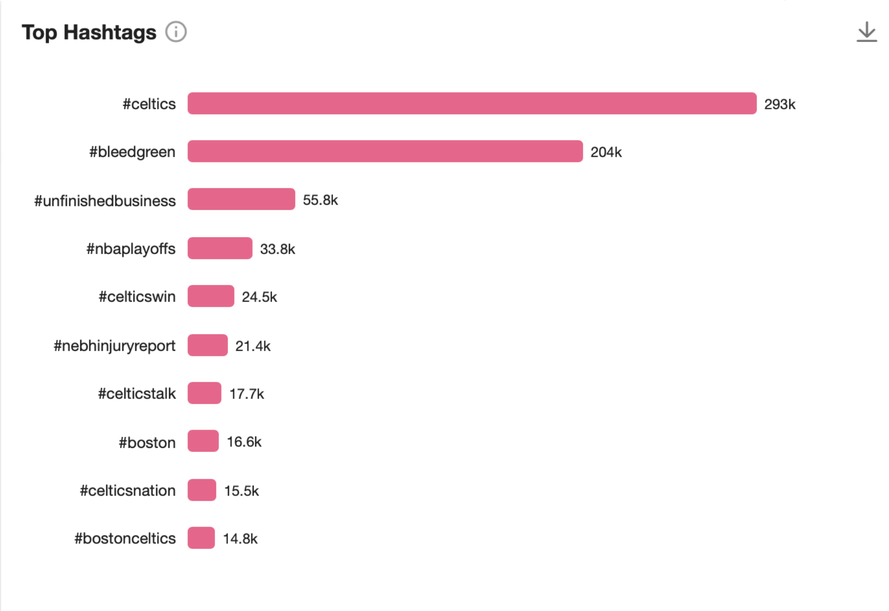
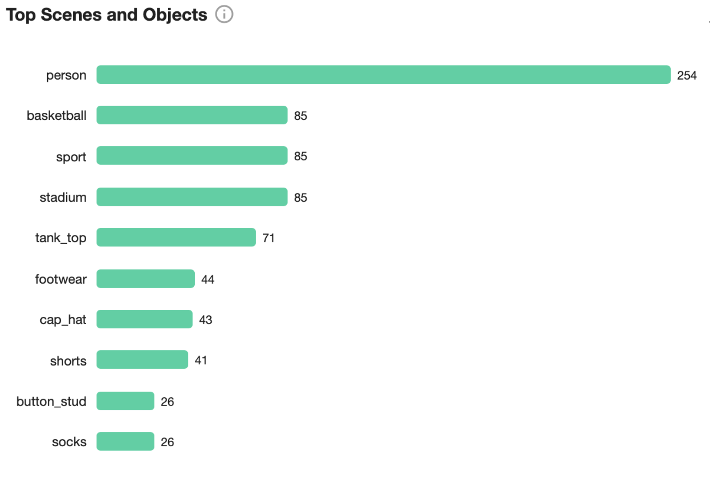
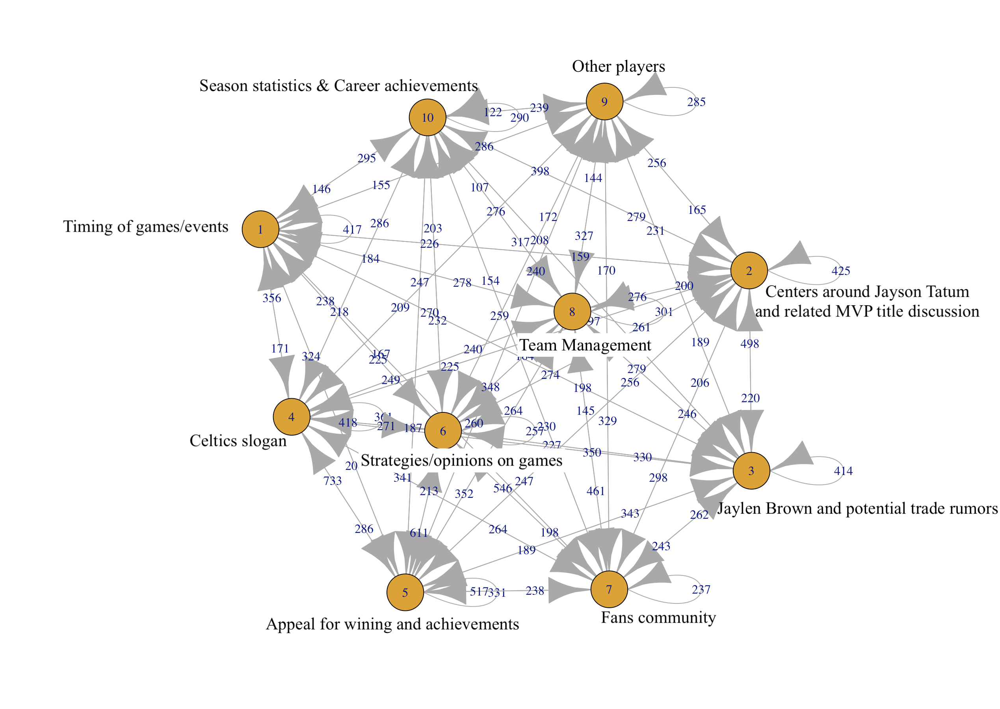

# Campaign Strategies

## A Customized Campaign to Enahnce Engagement on TikTok

### Content Strategy For TikTok

Based on the hashtags and words frequently mentioned in TikTok conversations about the Celtics, as collected from Meltwater, it is evident that a substantial portion of these discussions centers around fan identity and support. This is exemplified by the popularity of fan slogans such as "#bleedgreen", "#celticswin", and "#celticsnation" (see figure 6.1).



Additionally, among these conversations mentioning the Celtics, the recurrent mention of elements like "person", "tank top", "footwear", "cap hat", and "stadium" is likely indicative of references to players, potentially focusing on their sportswear during regular training scenes (see figure 6.2).



### A Customized #BleedGreen Campaign on TikTok

Named the "#BleedGreen" campaign, this TikTok-centered initiative aims to appeal to Celtics fans to purchase and wear sportswear modeled after popular players (e.g., sneakers) or Celtics-related apparel, and share these moments on TikTok to proudly signify their Celtics fan identity.

To be specific: 

1) By partnering with popular TikTok influencers and brands in the realms of sport fashion and basketball culture, we aim to leverage TikTok's unique media experience (e.g., click to view product information in videos) to create various content. This includes collaborating with influencers to produce a series of review videos introducing the daily wear of Jayson Tatum and Jaylen Brown, and partnering with popular sports brands to stream events where fans can participate in designing the new season's official jersey. During these events, fans will be encouraged to rank Celtics's classical jersey and other fans' designs. And we will award the winner of the design games the tickets to watch a live game in Celtics courtside VIP area.

2) Additionally, with a focus on creating content that has the potential to go viral on TikTok, we will encourage Celtics fans to "show their fan identity" on the platform by sharing their Celtics-related apparel. In our appeals, we will initially collaborate with Hall of Fame Celtics players to make a series of videos of them wearing fan-design jersey, and publish these videos on TikTok using popular hashtags such as #celticsnation and #bleedgreen in their videos. And then we will encourage our useres to also use these hashtags in the videos they wearing Celtics-related apparel. This strategy aims to ensure that these contents reach a larger fan community on TikTok who are interested in the sportswear culture surrounding the Celtics, as shown in our analysis. 

## A Pre-playoff Campaign on Twitter/X

### Topic Network Analysis

As we aim to promote audiences' overall engagements in fan-engagement conversations around the franchise, for the Twitter/X campaign, the "sna" package in r was utilized to perform a topic network analysis to see what other conversations can predict the popularity of fan engagement topics. 

Given that our sample data spans a one-year time range, we divided this duration into two-month segments, each defined as a unique time period. Figure 6.3 illustrates the dynamic relationship between topics across these time periods. It shows how the popularity of topic A in one period can influence or predict the popularity of topic B in the subsequent period. The figure also includes edge weights, representing the transition frequency values between two topics. These weights provide insights into how strongly one topic is likely to lead to increased engagement in another, enabling us to strategically focus our efforts on key topics that drive fan engagement.

Interpreting from figure 6.3:

- **Fan engagement topic as predictor**: Popularity about fan community (topic 7) in a previous period predicts the popularity of conversations around winning appeals (topic 5) in a following period, which in turn predicts the popularity of discussions around Celtics slogan (topic 4) in a subsequent period.

- **Topic 6 and 4**: Popularity of conversations around game strategies (topic 6) predicts the popularity of conversations around Celtics slogan (topic 4) in the following period.

- **Topic 8 and 7**: Popularity of conversations around team-management (topic 8) predicts the popularity of conversations around fan community (topic 7) in the following period.

```{r, echo=FALSE, message=FALSE}
data<-subset(data,(!is.na(data$topic)))

data <- data %>%
  mutate(topic = ifelse(grepl("^c\\(", topic), 
                        gsub("c\\(|\\)|\"", "", topic), 
                        topic)) %>%
  separate_rows(topic, sep = ",\\s*") %>%
  mutate(topic = as.numeric(topic))

data$Day <- as.Date(data$Day, format = "%Y-%m-%d")
data$Time_Period <- floor_date(data$Day, "2 months")


data <- data %>% 
  filter(!is.na(topic))

transitions <- data %>%
  group_by(Time_Period) %>%
  do({
    data.frame(Transition = paste(.$topic, lead(.$topic), sep = "->"))
  }) %>%
  filter(!is.na(Transition))
```

```{r}
transition_freq <- transitions %>%
  group_by(Transition) %>%
  summarise(Frequency = n())

edges <- strsplit(as.character(transition_freq$Transition), "->") %>%
  lapply(function(x) if (!any(is.na(x))) cbind(x[1], x[2])) %>%
  do.call(rbind, .) %>%
  na.omit() %>% 
  as.matrix()

filtered_edges <- edges[transition_freq$Frequency >= 5, ]
network <- graph_from_edgelist(filtered_edges, directed = TRUE)
E(network)$weight <- transition_freq$Frequency[transition_freq$Frequency >= 5]
```

```{r, include = FALSE}
plot(network, edge.label = E(network)$weight)
```



### Customized Strategies for Pre-playoff

- **Celtics Fan Stories (Customized for Topic 7)**: Aiming to let our fans to feel valued and see their personal experience as an integral part of the franchise's and community's shared experiences, we will select and feature fan stories on Celtics' official Twitter/X feed and the jumbotron during games. This also aims to emphasize the collective identity and unity of the fan community.

- **Weekly Roundtable (Customized for Topic 8)**: We will host a series of weekly roundtable discussion with a panel of players, coaches, analysts to discuss team's weekly performance and answer fans' most interested questions. By doing this, we aim to let the Celtics' fans feel like they are part of the team's inner circle, which might help to strengthen trust and reciprocal relationships among fan community.

- **Be the Coach (Customized for Topic 6)**: Aiming to increase fan's emotional and timely investment in the franchise's success and deepen their loyalty, we will engage them with weekly strategic/controversial questions on Twitter/X invites them to participate actively in the discourses related to game strategies, player performances, or hypothetical matchups. Through using specific hashtags and collaborate with social monitoring platforms to track the ongoing of these conversations, we aim to use dynamic data to further simulate the active creations of various sub-communities within the larger Celtics fan base, fostering niche groups that bond over specific topics or events around Celtics culture.

